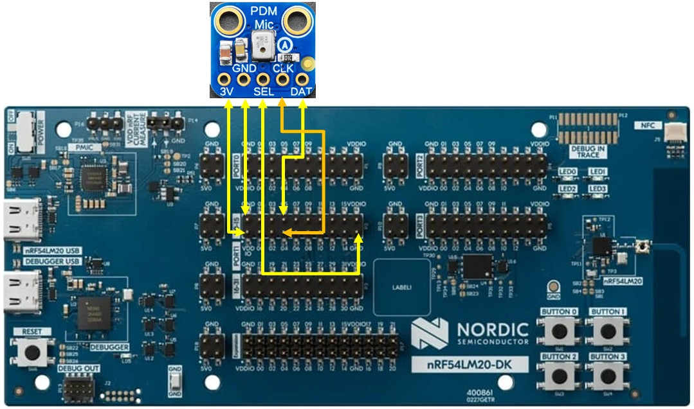
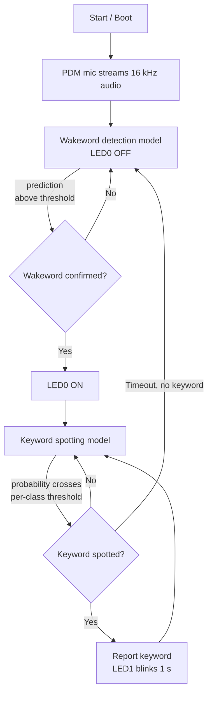

# Training Document: Building a Wake Word and Keyword Spotting (WW/KWS) Application with the nRF Edge AI Add-on

## Purpose and Scope

This document is a training reference for engineers who need to understand and build the **Wake Word and Keyword Spotting (WW/KWS)** sample application from Nordic Semiconductor's Edge AI Add-on for the nRF Connect SDK (NCS). It covers three areas: the overall application flow, how the underlying AI models work, and a step-by-step procedure to build, configure, and test the application, including optional runtime model observability.

The application covered in this document lives at `applications/ww_kws` in the Edge AI Add-on and targets the [**nRF54LM20 DK**](https://www.nordicsemi.com/Products/Development-hardware/nRF54LM20-DK) (PCA10184, board target `nrf54lm20dk/nrf54lm20b/cpuapp`), which integrates Nordic's **Axon NPU**. The application will use a PDM MEMS microphone (MP34DT01-M). We will use the [Adafruit 3492](https://www.adafruit.com/product/3492) breakout board.  

---

## 1. Application Overview

The WW/KWS application demonstrates two chained speech-recognition tasks running on-device:

1. **Wake word detection** — continuously listens for a single trigger phrase. The bundled model listens for "Okay Nordic".
2. **Keyword spotting (KWS)** — once the wake word is detected, the application switches to recognizing a fixed set of short voice commands: Go, Stop, Up, Down, Yes, No, On, Off, Right, Left.

Audio is captured as single-channel, 16 kHz PCM from a PDM digital microphone and fed directly into nRF Edge AI models running on **Axon-based inference**. The application also has an optional **model observability** feature that captures runtime inference statistics and ships them off-device via Memfault.

### Hardware requirements

| Item | Detail |
|---|---|
| Development kit | nRF54LM20 DK (PCA10184) |
| Board target | `nrf54lm20dk/nrf54lm20b/cpuapp` |
| Microphone | PDM digital microphone, left channel only (tested with Adafruit PDM MEMS Microphone, product 3492) |
| Mic wiring | `3V → VDD:IO`, `GND → GND`, `SEL → GND` (selects left channel), `CLK → P1.4`, `DAT → P1.5` |



---

## 2. General Structure of the Flow

The application behaves as a two-stage state machine that gates one model behind the other. This is the core architectural idea to understand before touching any code:



Key behavioral points:

- **Stage gating.** The system starts in the wake word stage. Only after the wake word is confirmed does it move to keyword spotting. After a configurable idle period with no keyword detected, it falls back to the wake word stage automatically.
- **Configurable operating modes.** Kconfig options let you pin the application into a single mode for testing or deployment: wake-word-gated KWS (default, both stages active), wake-word-only, or KWS-only.
- **Two independent postprocessing layers**, one per model, described in detail in Section 3.
- **Cross-cutting observability.** Both stages can optionally feed their inference results into the nRF Edge AI Observability Library, which runs alongside the state machine without altering its logic (see Section 4).


---

## 3. How the AI Model Works

### 3.1 Two classifiers, two postprocessing strategies

Both stages are ordinary classification models: for each audio window they emit a **probability vector** across their output classes. What differs is how the raw per-window probabilities are turned into a stable detection decision, because a single noisy frame should not be allowed to trigger a false detection.

**Wake word stage (binary-style detector):**

- The model outputs a wake word probability for each audio frame (roughly every 30 ms of audio).
- The application keeps a **prediction history window**: a ring buffer of the last *N* per-frame predictions (`CONFIG_WW_HISTORY_SIZE`).
- A frame counts as a "hit" if its probability exceeds `CONFIG_WW_PROBABILITY_THRESHOLD` (expressed in 1/1000 units).
- The wake word is confirmed only when the number of hits in the history window reaches `CONFIG_WW_COUNT_THRESHOLD`.

This history-based voting scheme trades a small amount of latency for strong rejection of transient false positives — a single loud noise or a partial phrase will not, by itself, cross the count threshold.

**Keyword spotting stage (multi-class detector):**

- The model outputs a probability per keyword class every audio window.
- Each class's probability is smoothed over time using an **exponential moving average (EMA)**, with the weight of new samples controlled by `CONFIG_KWS_EMA_ALPHA` (1/1000 units). This suppresses frame-to-frame jitter in the classifier's output.
- A keyword is reported once its smoothed probability satisfies its class-specific detection criteria.
- If no keyword is confirmed within `CONFIG_KWS_PERIOD_MS` (in wake-word-gated mode), the application times out and returns to the wake word stage.

### 3.2 Where the models come from

The bundled models are not something you train from raw audio yourself in this repository — they are produced by **Nordic Edge AI Lab** and then dropped into the application's `nrf_edgeai_generated` folders as generated C model artifacts (headers/sources exposing a model getter function) compiled for the **Axon NPU**.

For the wake word model specifically, Edge AI Lab offers a **Text-to-wake-word** pipeline (documented at the Wake Word Detection page referenced below):

- You provide only the desired **wake phrase as text** — no audio recording or labeling is required.
- The requirements for a valid phrase: English characters only, 1 to 3 words, 4 to 30 characters total, avoiding very common phrases, and using words that are easy to pronounce.
- Internally, the platform synthesizes and augments the audio training data needed to represent that phrase in many acoustic conditions, then trains and optimizes a wake word classifier automatically. The full process typically takes about one hour, and progress is lost if the job is stopped mid-way.
- The result is a model compiled and ready for inference on the **Axon NPU**, delivered as a downloadable, deployment-ready package.

This is conceptually different from a general-purpose keyword spotting or classification workflow (Neuton models, or the Axon Model Builder), which requires you to upload a labeled dataset. Text-to-wake-word exists specifically to remove the data-collection burden for the single-phrase wake word use case.

### 3.3 Model observability: understanding runtime behavior after deployment

A model that performs well in the lab can behave differently once deployed, because the acoustic environment, background noise, and usage patterns are not fully represented in training data. The **nRF Edge AI Observability Library (`nrf_edgeai_obsv`)** exists to make that drift visible without requiring you to log raw audio.

**Purpose.** The library observes the same probability vector the model already produces per inference and turns it into small, structured statistical snapshots. It is inference-engine agnostic — it works with the nRF Edge AI Library, Axon NPU, or Edge Impulse deployments, since all of them ultimately produce a probability vector.

Collected data supports four practical uses:

- **Model quality monitoring** — verify prediction confidence and class frequencies stay within expected ranges after deployment.
- **Dataset collection guidance** — identify which classes are under-represented or frequently confused in the field, to target future data collection.
- **Retraining triggers** — detect distribution shift early enough to decide on a model update before accuracy visibly degrades.
- **A/B testing** — compare metric snapshots between devices running different model versions under real production conditions.

**Architecture — three cooperating layers:**

1. **Core (`lib/nrf_edgeai_obsv/`)** — a portable, mutex-free state machine that accumulates metric counters as inference results arrive. It has no Zephyr dependency, so it can run on bare metal, other RTOSes, or in host-side test builds.
2. **Zephyr wrapper (`lib/nrf_edgeai_obsv/`)** — wraps the core in a mutex-protected context so multiple threads can safely feed inferences and trigger encoding, and wires the library into Zephyr's CMake/Kconfig/logging build system.
3. **Memfault CDR transport (`lib/nrf_edgeai_obsv_memfault/`)** — encodes accumulated metric snapshots as a CBOR blob and stages them as a Memfault **Custom Data Recording (CDR)**, which the Memfault SDK then uploads to the cloud on its normal transport drain cycle.

Metrics are driven by two possible input streams: **output metrics** consume the model's class-probability vector (via `nrf_edgeai_obsv_update_probs()`), while **input-feature metrics** consume the extracted feature vector fed to the model (via `nrf_edgeai_obsv_update_features()`). Each registered metric declares which stream it needs, and the library routes updates accordingly.

**Built-in metric: Probability distribution.** This metric builds a per-class histogram over the `[0, 1]` probability range. Every call to `nrf_edgeai_obsv_update_probs()` increments one histogram bin per class, based on that class's output probability for the current inference. The result is a `num_classes × bin_num` matrix of counters (row = class, column = probability bin). For example, a class that repeatedly lands in the highest bin is being predicted with high confidence; a class whose counts are spread thinly across low bins may be poorly separated from other classes and is a candidate for more/better training data.

**Built-in metric: Transition matrix.** This metric counts how many times the dominant class (the argmax of the probability vector) changed from class *i* to class *j* across consecutive inferences. The result is a square `num_classes × num_classes` matrix, where row *i* is the previous dominant class and column *j* is the current one. In the WW/KWS application, this is registered only for the keyword spotting stage, where it is useful to see, for example, whether "Yes" and "No" are frequently confused with each other in the field, or whether one keyword dominates usage.

In the WW/KWS application specifically:

- The **wake word stage** registers only the **probability distribution** metric.
- The **keyword spotting stage** registers both the **probability distribution** and the **transition matrix** metrics.
- Each stage owns its own observability context and Memfault transport binding, implemented in `src/ww/wakeword.c` and `src/kws/kws.c` respectively.
- Metrics are collected automatically every 24 hours by default (`CONFIG_NRF_EDGEAI_OBSV_MEMFAULT_AUTO_COLLECT_INTERVAL_SEC`) and uploaded to Memfault as a Custom Data Recording.

---

## 4. Step-by-Step: Building the Application

### Step 1 — Decide on the model source

You have two choices before writing any code:

- **Use the bundled models as-is.** The application ships with a working "Okay Nordic" wake word model and a 10-keyword spotting model, both already compiled for the Axon NPU. Skip to Step 2.
- **Generate your own wake word.** If you need a different trigger phrase, use the **Text-to-Wake-Word** feature of Nordic Edge AI Lab (`https://ai.lab.nordicsemi.com/`):
  1. Enter the desired wake phrase as text (English only, 1–3 words, 4–30 characters; avoid overly common phrases and hard-to-pronounce words).
  2. Play back the generated pronunciation sample and confirm it sounds correct; adjust capitalization/spacing if it does not.
  3. Click **Start** to begin training. This runs automatically and takes about an hour; do not stop it mid-way or all progress is lost.
  4. Once training completes, download the finished model package, compiled for the Axon NPU.
  - Alternatively, browse Nordic's ready-to-use model catalog for a pre-trained option instead of training your own.

### Step 2 — Set up the nRF Connect SDK environment

Follow Nordic's standard NCS environment setup for your chosen build tool (VS Code with the nRF Connect extension, or command-line `west`), and ensure the Edge AI Add-on is present in your west workspace manifest alongside the NCS repositories.

### Step 3 — Wire up the hardware

Connect a PDM digital microphone to the nRF54LM20 DK following the pin mapping in Section 1 (left channel selected by grounding `SEL`). If you use a different microphone module, update the PDM driver configuration in `src/dmic.c` to match its electrical and timing characteristics.

### Step 4 — (Optional) Replace the bundled models

If you generated a custom wake word or keyword set in Step 1:

**Wake word model:**
1. Replace the files in `src/ww/nrf_edgeai_generated` with the files downloaded from Edge AI Lab.
2. In `ww_init()`, set the `ww_model` pointer using the model getter function exposed by the newly generated files.
3. Re-tune `CONFIG_WW_PROBABILITY_THRESHOLD`, `CONFIG_WW_HISTORY_SIZE`, and `CONFIG_WW_COUNT_THRESHOLD` for the new model's behavior.

**Keyword spotting model:**
1. Replace the files in `src/kws/nrf_edgeai_generated` with the files downloaded from Edge AI Lab.
2. In `kws_init()`, set the `kws_model` pointer using the new model's getter function.
3. Update the `keyword_detection_ctxs` array in `src/kws/kws.c` with the keyword labels from the new `nrf_edgeai_user_model_labels.h` and set per-keyword detection thresholds.
4. If observability is enabled, update `CONFIG_NRF_EDGEAI_OBSV_MAX_CLASSES` to the number of keywords plus 2 (for auxiliary classes).
5. Re-tune `CONFIG_KWS_PERIOD_MS` and `CONFIG_KWS_EMA_ALPHA` as needed.

### Step 5 — Optional configuration of the application (Kconfig)

Edit `prj.conf` (debug build type, default) or `prj_release.conf` (release build type) to set the application's operating mode and tuning parameters. For this example, no additional configuration is needed.

| Kconfig option | Type | Purpose |
|---|---|---|
| `CONFIG_APP_MODE_WW_GATED_KWS` | bool | Default mode: run KWS only after wake word is detected; falls back after a timeout with no keyword. |
| `CONFIG_APP_MODE_WW_ONLY` | bool | Run wake word detection continuously, never switch to KWS. |
| `CONFIG_APP_MODE_KWS_ONLY` | bool | Run keyword spotting continuously, skipping the wake word gate. |
| `CONFIG_WW_PROBABILITY_THRESHOLD` | int | Wake word probability threshold, in 1/1000 units. |
| `CONFIG_WW_HISTORY_SIZE` | int | Length of the wake word prediction history (each entry ≈ 30 ms of audio). |
| `CONFIG_WW_COUNT_THRESHOLD` | int | Number of history entries above threshold required to confirm the wake word. |
| `CONFIG_KWS_PERIOD_MS` | int | Length of the keyword spotting window in wake-word-gated mode. |
| `CONFIG_KWS_EMA_ALPHA` | int | EMA coefficient for class probability smoothing, in 1/1000 units. |
| `CONFIG_MODELS_OBSERVABILITY` | bool | Wires the observability library into both bundled models. |
| `CONFIG_MODELS_OBSERVABILITY_MDS` | bool | Enables the Memfault Bluetooth LE (MDS) transport for observability data. |


### Step 6 — Build the application

The Wake Word and Keyword Spotting application can be found in the folder `EDGE-AI\applications\ww_kws`. If you want to make modifications, you can copy this folder within the project to preserve the original project version.

Select the `ww_kws` folder within **Visual Studio Code**, right-click it, and select `nRF Connect: Add Folder As Application`. In the NRF CONNECT window, the application `ww_kws` should be added. Select `Add build configuration` in this window. For this example, no changes are needed. The SDK should point to the version installed by the `edge-ai-addon` installer.

Build for the nRF54LM20 DK using your preferred NCS build workflow, selecting the `nrf54lm20dk/nrf54lm20b/cpuapp` board target (default setting).

Use the `prj_release.conf` build type (via the standard NCS custom build type mechanism) for a release build with logging disabled and optimizations enabled.

### Step 7 — Program the board

Flash the built firmware image to the DK using the `Flash nRF54LM20 DK` option in the ACTIONS window of the nRF Connect Extension. 

### Step 8 — Test the application

1. Connect the DK to your computer over USB. It exposes two serial ports (COM ports on Windows; `/dev/ttyACM*` on Linux; `/dev/tty*` on macOS). 
2. Open two terminal sessions: one for Zephyr logs, one for the application's control output on UART30 (VCOM0).
3. Say the wake word phrase, "Okay Nordic" (or your custom phrase).
4. Confirm **LED0** lights up, and the UART30 log shows `Wakeword detected`.
5. Say one of the bundled keywords (for example, "Yes" or "No").
6. Confirm **LED1** blinks for one second, and the UART30 log shows `Keyword spotted: <word>`.
7. Stop speaking and wait for the timeout; the log will show `Keyword spotting window timeout` and the application returns to the wake word stage.

Expected UART30 output over a full cycle:

```
Waiting for wakeword
Wakeword detected
Waiting for keywords
Keyword spotted: Yes
Keyword spotting window timeout
```


## 5. Quick Reference: Key Takeaways

- The application is a **two-stage gated state machine** (wake word → keyword spotting → back), not a single monolithic classifier.
- Each stage's raw per-frame probability is stabilized differently: **history-window voting** for the wake word, **EMA smoothing** for keyword spotting. This is what prevents single noisy frames from causing false triggers.
- Models are **not trained by hand in this repo** — they are produced by Nordic Edge AI Lab (Text-to-wake-word for the wake phrase) and dropped in as generated, Axon-NPU-compiled artifacts.
- **Observability is an optional, non-intrusive add-on**: it taps the same probability vector the model already produces and turns it into histograms (probability distribution) and confusion counts (transition matrix) that ship to Memfault for offline analysis — it does not change detection logic.

---

## Sources

- [Wakeword and Keyword Spotting application (README)](https://nrfconnectdocs.nordicsemi.com/addons/addon-edge-ai/latest/applications/ww_kws/README.html)
- [nRF Edge AI Observability Library — Overview](https://nrfconnectdocs.nordicsemi.com/addons/addon-edge-ai/latest/libraries/nrf_edgeai_obsv.html#nrf-edgeai-obsv-lib)
- [nRF Edge AI Observability Library — Built-in metric: Probability distribution](https://nrfconnectdocs.nordicsemi.com/addons/addon-edge-ai/latest/libraries/nrf_edgeai_obsv.html#nrf-edgeai-obsv-metrics-built-in-probability)
- [nRF Edge AI Observability Library — Built-in metric: Transition matrix](https://nrfconnectdocs.nordicsemi.com/addons/addon-edge-ai/latest/libraries/nrf_edgeai_obsv.html#nrf-edgeai-obsv-metrics-built-in-transition)
- [Edge AI Lab — Wake Word Detection](https://docs.nordicsemi.com/r/bundle/edge-ai-lab/page/wake_word.html)

---

[Next: _Change wake-word_](03-change-wakeword.md)
